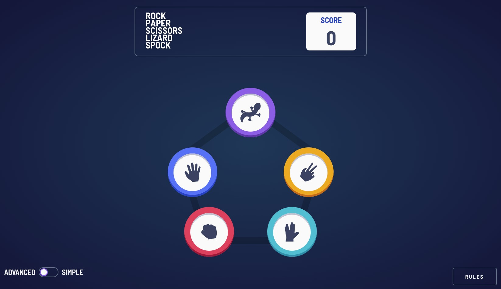

# Frontend Mentor - Rock, Paper, Scissors solution

This is a solution to the [Rock, Paper, Scissors challenge on Frontend Mentor](https://www.frontendmentor.io/challenges/rock-paper-scissors-game-pTgwgvgH). Frontend Mentor challenges help you improve your coding skills by building realistic projects. 

## Table of contents

- [Overview](#overview)
  - [The challenge](#the-challenge)
  - [Screenshot](#screenshot)
  - [Links](#links)
- [My process](#my-process)
  - [Built with](#built-with)
  - [What I learned](#what-i-learned)
  - [Continued development](#continued-development)
- [Author](#author)

## Overview

### The challenge

Users should be able to:

- View the optimal layout for the game depending on their device's screen size
- Play Rock, Paper, Scissors against the computer
- Maintain the state of the score after refreshing the browser _(optional)_
- Play Rock, Paper, Scissors, Lizard, Spock against the computer 

### Screenshot

### Links

- Solution URL: [Add solution URL here](https://your-solution-url.com)
- Live Site URL: [Add live site URL here](https://your-live-site-url.com)

## My process

### Estimated time

14 hours

### Actual time

7.5 hours

### Built with

- Semantic HTML5 markup
- Flexbox
- CSS Grid
- [Vue](https://vuejs.org/) - Vue framework
- [SASS](https://sass-lang.com/)
- [Vite](https://vitejs-dev.translate.goog/?_x_tr_sl=en&_x_tr_tl=ru&_x_tr_hl=ru&_x_tr_pto=sc)

### What I learned

Some basics of how to use Composition API with Single Page Components, for example:

- how to define props and emits inside <script setup>
- how to use watchers and lifecycle hooks

### Continued development

I am looking forward to getting more comfortable with using Composition API and creating more elegant code on it.

## Author

- Frontend Mentor - [@leqsar](https://www.frontendmentor.io/profile/yourusername)

